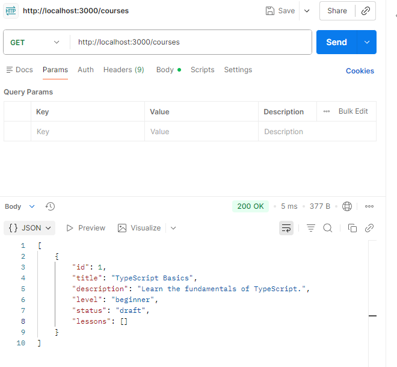
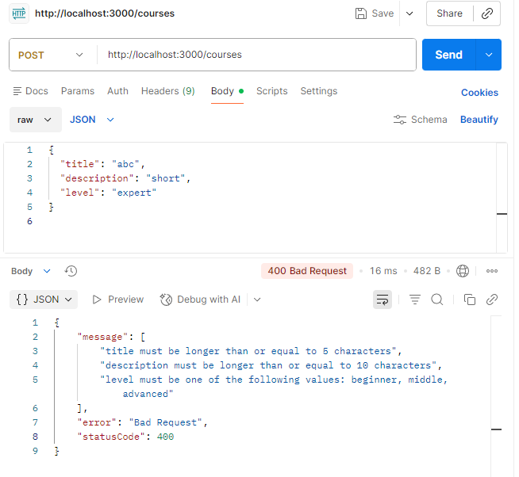
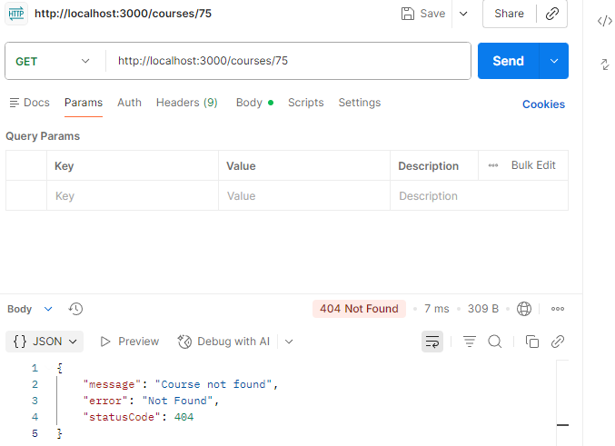
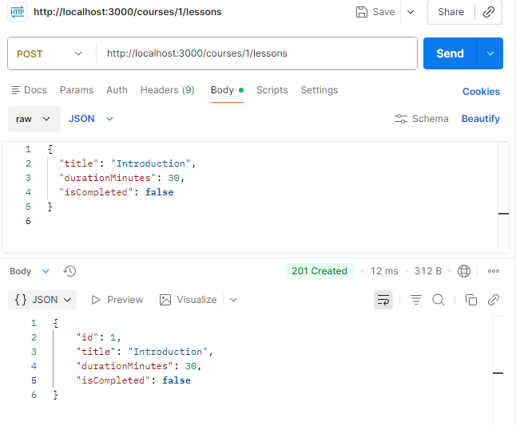

# Homework 19 — NestJS Small API (Course Planner)

## Requirements
- Node.js
- npm

## Setup
```bash
npm install
```

## Run
```bash
npm run start:dev
```

Server will start on `http://localhost:3000` (or `PORT` env var).

## Endpoints

### Health
- `GET /health`

### Courses
- `GET /courses`
- `GET /courses/:id`
- `POST /courses`
- `PATCH /courses/:id/status`

### Lessons (inside courses)
- `POST /courses/:id/lessons`
- `GET /courses/:id/lessons`
- `PATCH /courses/:courseId/lessons/:lessonId/complete`

## Examples (valid request bodies)

### Create a course
`POST /courses`
```json
{
  "title": "TypeScript Basics",
  "description": "Learn the fundamentals of TypeScript.",
  "level": "beginner"
}
```

### Change course status
`PATCH /courses/:id/status`
```json
{
  "status": "active"
}
```

### Add a lesson to a course
`POST /courses/:id/lessons`
```json
{
  "title": "Introduction",
  "durationMinutes": 30,
  "isCompleted": false
}
```

### Complete a lesson
`PATCH /courses/:courseId/lessons/:lessonId/complete`
- No request body.

## Screenshot placeholders

Figure 1 — `GET /health` response


Figure 2 — Create course + returned `draft` status


Figure 3 — Invalid DTO (400) example


Figure 4 — Missing course (404) example


Figure 5 — Add lesson (lesson starts with `isCompleted: false`)


